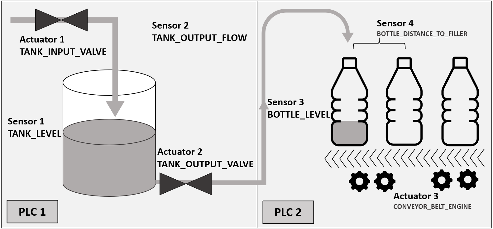

# ICSSIM
This is the ICSSIM source code and user manual for simulating industrial control system testbed for cybersecurity experiments.

ICSSIM is a framework to build customized virtual ICS security testbeds cyber threats and attacks can be investigated, and mitigations evaluated. ICSSIM is built on top of the Docker container technology, which provides realistic network emulation and runs ICS components on isolated private operating system kernels. 

To demonestrate its functionality we create a bottle filling factory simulation using ICSSIM, although building a testbed using ICSSIM is not limited to this example, and we can replace bottle filling factory simulation with any other open-loop controlling process simulations.

# Sample Bottle Filling Factory
The bottle-filling factory control process is responsible for filling bottles using a water tank repository. The below figure shows the overall scenario including process and hardware. The proposed control process consists of two main hardware zones, each controlled by a standalone PLC, called PLC-1 and PLC-2. PLC-1 manages the water tank and its input and output valves. PLC-2 manages the conveyor belts to replace the filled bottle with an empty one.




# Run a Sample Bottle Filling Factory

## Run in Docker container Environement

### Pre steps
Make sure that you have already installed the following applications and tools. 

* git
* Docker
* Docker-Compose

### Getting ICSSIM and the sample project
Clone The probject into your local directory using following git command.
```
git clone https://github.com/AlirezaDehlaghi/ICSSIM ICSSIM
```

check the file [Configs.py](src/Configs.py) and make sure that EXECUTION_MODE varibale is set to EXECUTION_MODE_DOCKER as follow:
```
EXECUTION_MODE = EXECUTION_MODE_DOCKER
```

### Running the sample project 
Run the sample project using the prepared script 
[init.sh](deployments/init.sh)
```
cd ICSSIM/deployments
./init.sh
```
### Check successful running
If *init.sh* commands runs to the end, it will show the status of all containers. In the case that all containers are 'Up', then project is running successfully.
You could also see the status of containers with following command:
```
sudo docker-compose ps
```

### Operating the control system and apply cyberattacks
In the directory [deployments](deployments/) there exist some scripts such as [hmi1.sh](deployments/hmi1.sh), [hmi2.sh](deployments/hmi2.sh) or [attacker.sh](deployments/attacker.sh) which can attach user to the container. 
## Run in GNS3
To run the ICSSIM and the sample Bottle Filling factory clone the prject and use the portable GNS3 file to create a new project in GNS3.

### Getting ICSSIM and the sample project
Clone The probject into your local directory using following git command.
```
git clone https://github.com/AlirezaDehlaghi/ICSSIM ICSSIM
```

### Import Project in GNS3
Import the portable project ([deployments/GNS3/ICSSIM-GNS3-Portable.gns3project](deployments/GNS3/ICSSIM-GNS3-Portable.gns3project)) using menu **File->Import Portable Project**

